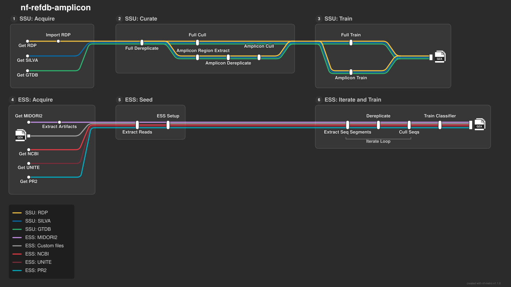

# nf-refdb-amplicon

[](https://www.nextflow.io/)
[](https://docs.conda.io/en/latest/)

Nextflow pipeline for generating reference databases for amplicon sequences.

> [!CAUTION]
> :construction: *This pipeline is in beta development. Workflow commands and modes of operation may change.* :construction:

---
## Pipeline Overview
<p align="center">
    <a href="docs/img/pipeline.svg">
        
    </a>
</p>

---
## Getting Started

### Requirements

- [Nextflow](https://www.nextflow.io/) (_>= 24.04_)
- [Conda](https://conda-forge.org/) (_Miniforge/Mambaforge recommended_)


### Installation

#### 1. Install nextflow

**Standalone installation (recommended)**

```bash
java -version
curl -s https://get.nextflow.io | bash
mv nextflow ~/bin/
```

**Conda installation**

```bash
conda create -n nextflow -c conda-forge -c bioconda -c defaults nextflow
conda activate nextflow
```

>[!TIP]
> For more info on nextflow please visit [Nextflow documentation](https://docs.seqera.io/nextflow/?__hstc=247481240.43f4da109a9544f90ea47ec4dba6e0f8.1767891341744.1781221442473.1781497907630.12&__hssc=247481240.1.1781497907630&__hsfp=7c1ebc5cd52a44b32f139dab9b7844fb)


#### 2. Clone the Pipeline

```bash
git clone https://github.com/mikerobeson/nf-refdb-amplicon
cd nf-refdb-amplicon
```


#### 3. Deploying the Pipeline

> [!IMPORTANT]
> Choose the setup method based on your operating system and execution profile.

The pipeline can be deployed locally or on cluster.  

##### Conda (recommended)

> [!NOTE]
> - Currently, the pipeline supports Conda rather than Docker.
> - Docker-based QIIME 2 images have reported runtime and compatibility issues on M1/M2 (emulation problems, crashes, or missing platform support).
> - Use the conda profile (`-profile local,conda`) or point to an existing QIIME 2 conda environment with `--qiime_conda_env /path/to/env`.
> - The pipeline supports Conda for both local and cluster execution (e.g., `-profile local,conda` and `-profile cluster,conda`).
> - However in macOS, Nextflow cannot automatically set `CONDA_SUBDIR=osx-64`; the user needs to manually create the QIIME 2 environment with `CONDA_SUBDIR=osx-64` and then supply its path via `--qiime_conda_env`.
> - We are actively working on deploying the pipeline via containers (Docker, Singularity)!


##### For 🍎 macOS
**Step 1:** Create the QIIME 2 environment manually:

```bash
# Required for Apple Silicon (M1/M2/M3) Macs
CONDA_SUBDIR=osx-64 conda env create \
    --name rachis-qiime2-2026.4 \
    --file https://raw.githubusercontent.com/qiime2/distributions/refs/heads/dev/2026.4/qiime2/released/rachis-qiime2-osx-64-conda.yml
```

**Step 2:** Get the path to your environment:

```bash
conda env list | grep rachis-qiime2-2026.4
```

**Step 3:** Run the pipeline pointing to the existing environment:

```bash
nextflow run main.nf \
    --pipeline_type <ssu|ess> \
    --qiime_conda_env /path/to/conda/envs/rachis-qiime2-2026.4 \
    -profile local,conda
```


##### For 🐧 Linux (auto-install)
On Linux, the pipeline will **automatically** create the QIIME 2 environment from the YAML files provided in the `assets/` folder. Simply point `--qiime_conda_env` to the YAML file:

```bash
nextflow run main.nf \
    --pipeline_type <ssu|ess> \
    --qiime_conda_env assets/rachis-qiime2-linux-64-conda.yml \
    -profile local,conda
```

> [!NOTE]
> Depending on the development cycle you may also need to install the latest version of RESCRIPt manually into your QIIME 2 environment:

```bash
conda activate qiime2-amplicon-2024.10
git clone https://github.com/bokulich-lab/RESCRIPt
cd RESCRIPt
pip install .
```


---
## Usage

### Basic Usage
```bash
nextflow run main.nf --pipeline_type <ssu|ess> -profile <local,conda|cluster,conda>
```

**Show help:**
```bash
nextflow run main.nf --help         # Global options
nextflow run main.nf --help ssu     # SSU workflow options
nextflow run main.nf --help ess     # ESS workflow options
```

> [!IMPORTANT]
> For detailed information on individual workflows, please refer to the [SSU README](docs/ssu_README.md) and [ESS README](docs/ess_README.md) documents.

### Pipeline Types

| Type | Description |
|------|-------------|
| `ssu` | Build Naive Bayes classifiers from SSU rRNA gene reference databases (SILVA, GTDB, RDP) |
| `ess` | Build classifiers using iterative `extract-seq-segments` approach (under development) |


### Profiles
Combine an executor profile with an engine profile:

| Executor | Engine | Usage | Description |
|----------|--------|-------|-------------|
| `local` | `conda` | `-profile local,conda` | Run locally with Conda |
| `cluster` | `conda` | `-profile cluster,conda` | Submit to SLURM HPC with Conda |
| `local` | `docker` | `-profile local,docker` | Run locally with Docker (recommended for macOS/Linux desktops) |

> [!NOTE]
> Docker support is not currently available; but it is planned for a future release.


### Global Parameters

| Parameter | Default | Description |
|-----------|---------|-------------|
| `--pipeline_type` | — | Required. `ssu` or `ess` |
| `--qiime_conda_env` | YAML in assets/ | Path to existing QIIME 2 conda environment (for conda profile) |
| `--outdir` | `results` | Output directory |
| `--max_memory` | `16.GB` | Max memory per process |
| `--max_cpus` | `4` | Max CPUs per process |
| `--max_time` | `48.h` | Max time per process |
| `--help` | `false` | Show help message |


---
## Cite
If you make use of this pipeline please cite RESCRIPt:

- Michael S Robeson II, Devon R O'Rourke, Benjamin D Kaehler, Michal Ziemski, Matthew R Dillon, Jeffrey T Foster, Nicholas A Bokulich. (2021) RESCRIPt: Reproducible sequence taxonomy reference database management. PLoS Computational Biology 17 (11): e1009581. doi: [10.1371/journal.pcbi.1009581](http://dx.doi.org/10.1371/journal.pcbi.1009581). [GitHub](https://github.com/bokulich-lab/RESCRIPt).

---

> [!NOTE] 
> An older Snakemake variant of this pipeline is available [here](https://github.com/mikerobeson/snake-ref-amplicon-pipe).